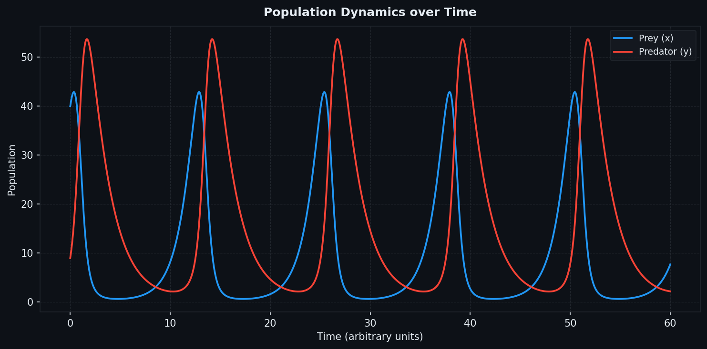
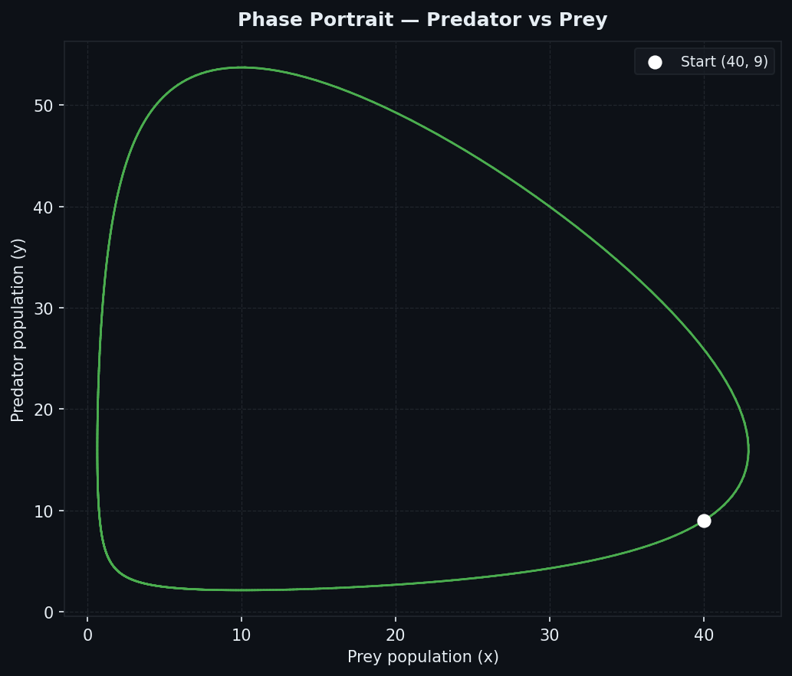
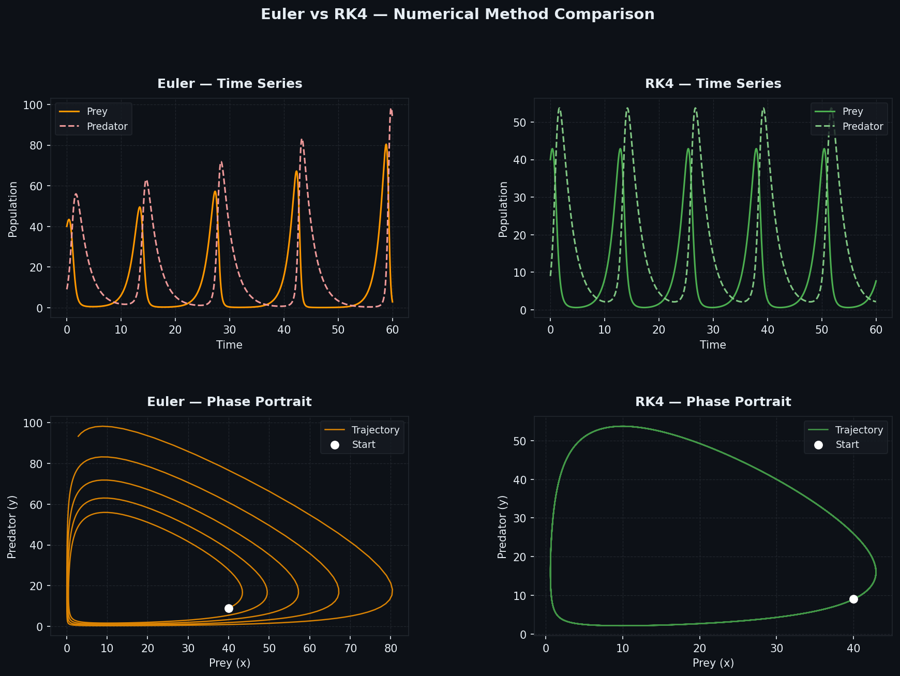

# Predator-Prey Population Dynamics Simulator

A numerical simulation of the **Lotka-Volterra predator-prey system** implemented in Python. Solves the ODE system using both **Explicit Euler** and **4th-order Runge-Kutta (RK4)** methods, and visualizes the results through time-series plots, phase portraits, and a direct method comparison.

---

## The Model

The Lotka-Volterra equations describe the dynamic relationship between two populations — a prey species and a predator species:

$$\frac{dx}{dt} = \alpha x - \beta x y$$

$$\frac{dy}{dt} = \delta x y - \gamma y$$

| Variable | Description |
|----------|-------------|
| `x` | Prey population |
| `y` | Predator population |
| `α` (alpha) | Prey natural birth rate |
| `β` (beta) | Predation rate coefficient |
| `δ` (delta) | Predator reproduction rate per prey eaten |
| `γ` (gamma) | Predator natural death rate |

The system is **autonomous** (time does not appear explicitly) and produces **periodic, oscillating solutions** — predator population peaks lag behind prey population peaks, creating a feedback cycle.

---

## Numerical Methods

### Explicit Euler (1st-order)

$$y_{n+1} = y_n + \Delta t \cdot f(t_n,\ y_n)$$

Simple single-evaluation scheme. First-order accurate — local truncation error is $O(\Delta t^2)$, global error is $O(\Delta t)$. In oscillating systems like Lotka-Volterra, Euler tends to **spiral outward** over time, injecting artificial energy into the system.

### Runge-Kutta 4 (4th-order)

$$k_1 = f(t_n,\ y_n)$$
$$k_2 = f\!\left(t_n + \tfrac{\Delta t}{2},\ y_n + \tfrac{\Delta t}{2} k_1\right)$$
$$k_3 = f\!\left(t_n + \tfrac{\Delta t}{2},\ y_n + \tfrac{\Delta t}{2} k_2\right)$$
$$k_4 = f(t_n + \Delta t,\ y_n + \Delta t \cdot k_3)$$
$$y_{n+1} = y_n + \frac{\Delta t}{6}(k_1 + 2k_2 + 2k_3 + k_4)$$

Four derivative evaluations per step. Fourth-order accurate — global error is $O(\Delta t^4)$. Produces a **closed loop** in phase space, correctly preserving the periodic structure of the system.

The architecture keeps solvers **model-agnostic**: both `euler()` and `rk4()` accept any derivative function `f(t, state, params)`, making them reusable for other ODE systems.

---

## Results

### Time Series (RK4)
Prey and predator populations over 60 time units. Populations oscillate out of phase — predator peaks follow prey peaks with a consistent lag.



### Phase Portrait (RK4)
Parametric plot of predator vs prey population. The **closed loop** confirms the system is conservative and the numerical method is not injecting or dissipating energy.



### Euler vs RK4 Comparison
Same parameters and timestep (`dt = 0.05`), different methods. The Euler phase portrait drifts from a closed orbit over time; RK4 maintains it.



---

## Project Structure

```
predator-prey/
├── model.py       # Lotka-Volterra derivative function
├── solver.py      # Euler and RK4 integrators (generic)
├── plot.py        # Visualization: time series, phase portrait, comparison
├── config.py      # Default simulation parameters
├── main.py        # Entry point with CLI argument support
└── output/        # Generated plots
```

---

## Usage

**Requirements:** Python 3.8+, matplotlib

```bash
pip install matplotlib
```

**Run with defaults:**
```bash
python main.py
```

Plots are saved to `output/`. To display them interactively instead:
```bash
python main.py --show
```

**CLI options:**

| Flag | Default | Description |
|------|---------|-------------|
| `--dt` | `0.05` | Timestep size |
| `--t_end` | `60.0` | Simulation end time |
| `--alpha` | `0.8` | Prey birth rate |
| `--beta` | `0.05` | Predation rate |
| `--delta` | `0.05` | Predator reproduction rate |
| `--gamma` | `0.5` | Predator death rate |
| `--prey` | `40.0` | Initial prey population |
| `--pred` | `9.0` | Initial predator population |
| `--out_dir` | `output` | Output directory for plots |

**Examples:**

```bash
# Larger timestep — makes Euler error more visible
python main.py --dt 0.5

# Parameter sensitivity: faster prey growth
python main.py --alpha 1.2 --gamma 0.4

# Longer simulation with a different initial condition
python main.py --t_end 120 --prey 20 --pred 5
```

---

## Default Parameters

```python
alpha  = 0.8    # prey double every ~1.25 time units (absent predators)
beta   = 0.05   # each encounter meaningfully reduces prey growth
delta  = 0.05   # predators reproduce from hunts at the same rate
gamma  = 0.5    # predator half-life ~2 time units (absent prey)

initial_state = [40.0, 9.0]   # [prey, predators]
dt            = 0.05
t_end         = 60.0
```